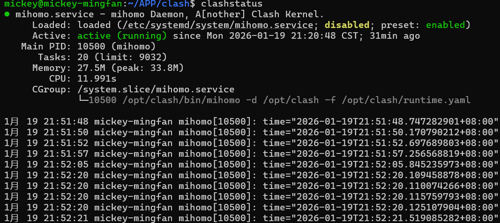
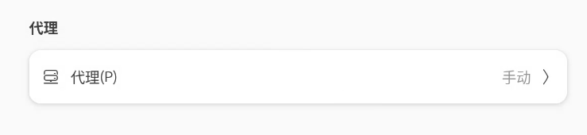
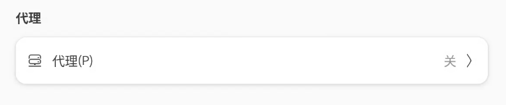

# Linux 一键安装 Clash


- 默认安装 `mihomo` 内核，[可选安装](https://github.com/nelvko/clash-for-linux-install/wiki/FAQ#%E5%AE%89%E8%A3%85-clash-%E5%86%85%E6%A0%B8) `clash`。
- 支持使用 [subconverter](https://github.com/tindy2013/subconverter) 进行本地订阅转换。
- 多架构支持，适配主流 `Linux` 发行版：`CentOS 7.6`、`Debian 12`、`Ubuntu 22.04.1 LTS`、`Ubuntu 24.04.1 LTS`。

## 说明

本项目来自[clash-for-linux-install](https://github.com/nelvko/clash-for-linux-install)，根据个人需要重新进行了修改，修改地方如下：

1. 添加主流web-ui控制台（[metacubexd](https://github.com/MetaCubeX/metacubexd)，[Yacd-meta](https://github.com/MetaCubeX/Yacd-meta)，[Yacd](https://github.com/haishanh/yacd)），默认Yacd-meta。

2. 修复了上游项目兼顾 普通用户 与 `sudo`用户 而造成的命令混乱。

3. mixin.yaml中添加了更为详细的DNS覆写规则和tun规则，支持ipv6，开箱即用。

4. 由我最喜欢的一版代码修改而来，clashstatus命令可以方便查看运行状态。

   

5. 2026.1.20修改：适配linux主流桌面环境，为桌面环境添加系统代理，通过`clashon`、`clashoff`一键控制桌面环境、终端环境代理

## 快速开始

### 环境要求

- 用户权限：`root` 或 `sudo` 用户。
- `shell` 支持：`bash`、`zsh`、`fish`。

### 一键安装

下述命令适用于 `x86_64` 架构

```bash
git clone --branch master --depth 1 https://gh-proxy.org/https://github.com/Hit-Mickey/clash-for-linux.git clash \
  && cd clash \
  && sudo bash install.sh
```

> 如遇问题，请在查阅[常见问题](https://github.com/nelvko/clash-for-linux-install/wiki/FAQ)及 [issue](https://github.com/nelvko/clash-for-linux-install/issues?q=is%3Aissue) 未果后进行反馈。

- 上述克隆命令使用了[加速前缀](https://gh-proxy.com/)，如失效请更换其他[可用链接](https://gh-proxy.com/)。
- 默认通过远程订阅获取配置进行安装，本地配置安装详见：在`resources`目录中新建`config.yaml`，将配置粘贴进去再执行安装脚本。
- 没有订阅？[click me](https://wd-gold.net/aff.php?aff=12861)。

### 自定义安装

1. 可以根据喜好自己提前修改mixin.yaml中的相关配置，**其中留空的变量名不要随意删除**，当然也可以在安装完后进行修改。
2. 若需更换web控制台，需要修改的地方有两处：
   1. `script`文件夹下`common.sh`的`ZIP_UI="${ZIP_BASE_DIR}/Yacd-meta-gh-pages.zip"`，修改压缩包名称即可，可用的压缩包在`resources/zip`文件夹下查看，当然也可以自己下载后放到该文件夹下。
   2. `resources`文件夹下`mixin.yaml`中的`external-ui:`，将名字改为对应web控制台的名字，可选项（yacd-meta，yacd，metacubexd）。如果是自己下载的压缩包，则为解压后的文件夹名称。

### 命令一览

执行 `clashctl` 列出开箱即用的快捷命令。

```bash
$ clashctl
Usage:
    clashctl    COMMAND [OPTION]
    
Commands:
    on                   开启代理
    off                  关闭代理
    ui                   面板地址
    status               内核状况
    proxy    [on|off]    系统代理
    tun      [on|off]    Tun 模式
    mixin    [-e|-r]     Mixin 配置
    secret   [SECRET]    Web 密钥
    update   [auto|log]  更新订阅
    upgrade     		 更新内核
```

💡`clashon` 等同于 `clashctl on`，`Tab` 补全更方便！

### 优雅启停（终端环境+桌面环境）

```bash
$ clashon
🖥️ 检测到桌面环境，正在设置系统 GUI 代理...
😼 已开启代理环境
```

 

```bash
$ clashoff
😼 已关闭代理环境
```

 

- 启停代理内核的同时，设置系统代理。
- 亦可通过 `clashproxy` 单独控制系统代理。

### Web 控制台

```bash
$ clashui
╔═══════════════════════════════════════════════╗
║                😼 Web 控制台                  ║
║═══════════════════════════════════════════════║
║                                               ║
║     🔓 注意放行端口：9090                      ║
║     🏠 内网：http://192.168.0.1:9090/ui       ║
║     🌏 公网：http://255.255.255.255:9090/ui   ║
║     ☁️ 公共：http://board.zash.run.place      ║
║                                               ║
╚═══════════════════════════════════════════════╝

$ clashsecret 666
😼 密钥更新成功，已重启生效

$ clashsecret
😼 当前密钥：666
```

- 通过浏览器打开 Web 控制台，实现可视化操作：切换节点、查看日志等。
- 若暴露到公网使用建议定期更换密钥。

### 更新订阅

```bash
$ clashupdate https://example.com
👌 正在下载：原配置已备份...
🍃 下载成功：内核验证配置...
🍃 订阅更新成功

$ clashupdate auto [url]
😼 已设置定时更新订阅

$ clashupdate log
✅ [2025-02-23 22:45:23] 订阅更新成功：https://example.com
```

- `clashupdate` 会记住上次更新成功的订阅链接，后续执行无需再指定。
- 可通过 `crontab -e` 修改定时更新频率及订阅链接。
- 通过配置文件进行更新：[pr#24](https://github.com/nelvko/clash-for-linux-install/pull/24#issuecomment-2565054701)

### `Tun` 模式

```bash
$ clashtun
😾 Tun 状态：关闭

$ clashtun on
😼 Tun 模式已开启
```

- 作用：实现本机及 `Docker` 等容器的所有流量路由到 `clash` 代理、DNS 劫持等。
- 原理：[clash-verge-rev](https://www.clashverge.dev/guide/term.html#tun)、 [clash.wiki](https://clash.wiki/premium/tun-device.html)。
- 注意事项：[#100](https://github.com/nelvko/clash-for-linux-install/issues/100#issuecomment-2782680205)

### `Mixin` 配置

```bash
$ clashmixin
😼 less 查看 mixin 配置

$ clashmixin -e
😼 vim 编辑 mixin 配置

$ clashmixin -r
😼 less 查看 运行时 配置
```

- 持久化：将自定义配置项写入`Mixin`（`mixin.yaml`），而非原订阅配置（`config.yaml`），可避免更新订阅后丢失。
- 配置加载：代理内核启动时使用 `runtime.yaml`，它是订阅配置与 `Mixin` 配置的合并结果集，相同配置项以 `Mixin` 为准。
- 注意：因此直接修改 `config.yaml` 并不会生效。

### 卸载

```bash
sudo bash uninstall.sh
```

## 常见问题

[wiki](https://github.com/nelvko/clash-for-linux-install/wiki/FAQ)
